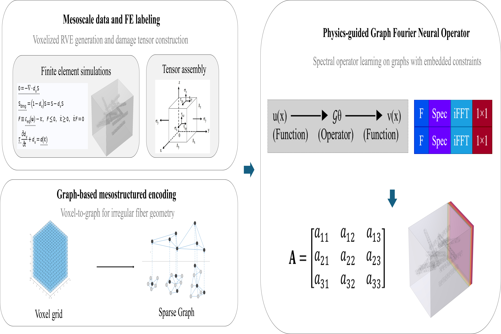

# GFNO for Anisotropic Damage Prediction in SSFRC

*Figure 1: Overview of the GFNO framework for anisotropic damage prediction.*

---

## Overview

This repository provides a physics-guided Graph Fourier Neural Operator (GFNO) framework for predicting the anisotropic damage tensor of short steel fiber reinforced concrete (SSFRC).

The model learns a mapping from mesoscale fiber geometry to the full damage tensor, capturing anisotropic mechanical behavior efficiently.

---

## Model Illustration

*Figure 2: Example predictions of anisotropic damage components.*

---

## Structure

code/ – GFNO training pipeline  
configs/ – training configuration  
splits/ – fixed train/val/test split  
data/ – dataset (4320 samples)  

---

## Dataset

- 4320 samples (.npz)
- Each sample includes:
  - segments  
  - label_D6  
  - global_features  

The dataset is fully included in this repository.

---

## Training

Run:

python code/train_gfno.py

---

## Reproducibility

- Fixed dataset splits are provided in `splits/`
- Group-based splitting avoids data leakage across rotations

---

## Notes

- Physics-guided design improves interpretability  
- The model captures anisotropic damage behavior  
- Results are reproducible with fixed settings  

---

## License

For academic research use only.